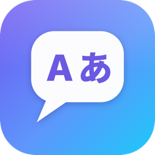

[🇬🇧 English](README.md) · [🇫🇷 Français](README.fr.md) · **🇪🇸 Español**

# Lexo

**Traduce el texto seleccionado en cualquier app de macOS — con un simple atajo.**

### [⬇️&nbsp; Descargar Lexo.dmg](https://github.com/Titi257/lexo/releases/latest/download/Lexo.dmg)

---

Selecciona texto, pulsa **`⌃⇧T`** *(Ctrl + Shift + T)*, y la traducción aparece en una pequeña burbuja junto a tu cursor. Eso es todo.

> 🔒 **100 % local** — la traducción se ejecuta en tu Mac mediante el motor de Apple. Sin peticiones de red, sin cuenta, sin telemetría.

## ✨ Funciones

|  |  |
|---|---|
| ⌨️ **Atajo global** | `⌃⇧T` *(Ctrl + Shift + T)* — configurable |
| 🌍 **En todas partes** | Navegador, Mail, PDF, Slack, Notas… |
| 🗣️ **Interfaz en 40 idiomas** | Todos los idiomas del sistema de macOS — automáticamente, o a tu elección en Preferencias |
| 🔒 **Privado y sin conexión** | Mediante `Translation.framework` de Apple |
| 💬 **Burbuja elegante** | El resultado aparece junto a tu cursor |
| 🪶 **Discreto** | Vive en la barra de menús, sin icono en el Dock |
| 📋 **Portapapeles preservado** | Restaurado igual tras cada traducción |
| 🔄 **Actualizaciones automáticas** | La app se actualiza sola, sin volver a descargar |

## 🚀 Instalación

1. **[Descarga `Lexo.dmg`](https://github.com/Titi257/lexo/releases/latest/download/Lexo.dmg)**.
2. Ábrelo y arrastra **Lexo** a **Aplicaciones**.
3. Abre **Lexo** desde Aplicaciones.

> ✅ Firmada y notarizada por Apple — sin aviso de «desarrollador no identificado» al abrir.

## 🟢 Primer inicio

Un breve asistente te guía:

1. **Accesibilidad** — pulsa *Abrir Ajustes*, luego activa **Lexo** en
   *Ajustes del Sistema → Privacidad y seguridad → Accesibilidad*. Imprescindible para leer tu selección.
2. **Idioma de destino** — el idioma **al que** traducir (francés por defecto), modificable en cualquier momento.

## ⚙️ Requisitos

- **macOS 15 (Sequoia)** o posterior
- **Mac Intel o Apple Silicon** — app universal

## 🧩 Uso

1. **Selecciona** texto en cualquier app.
2. Pulsa **`⌃⇧T`** *(Ctrl + Shift + T)*.
3. La burbuja muestra la traducción — `Esc` la cierra, **Copiar** la pone en el portapapeles.

> Primera traducción de un nuevo par de idiomas: macOS descarga el modelo (~30 MB) una sola vez. Después, todo es instantáneo y sin conexión.

## 🌐 Idiomas de la interfaz

La interfaz de Lexo (guía, preferencias, menús, burbuja) se muestra **automáticamente en 40 idiomas** — todos los idiomas del sistema de macOS (español, francés, inglés, alemán, japonés, árabe, chino, ruso, hindi…) — según el idioma de tu Mac. También puedes **elegir manualmente** un idioma en **Preferencias → General**, aplicado al instante. *(No confundir con los idiomas **traducidos**, proporcionados por Apple Translation.)*

## 🛟 Solución de problemas

- **No pasa nada con el atajo** → comprueba la **Accesibilidad** en Ajustes y reinicia la app.
- **«No se detectó ninguna selección»** → asegúrate de seleccionar texto antes de pulsar; en Slack / VS Code / Discord, inténtalo otra vez.
- **Conflicto de atajo** → redefínelo en **Preferencias**.

---

© 2026 Kevin Boileux — Todos los derechos reservados · <a href="https://kevin-boileux.com/es/lexo">kevin-boileux.com</a>

